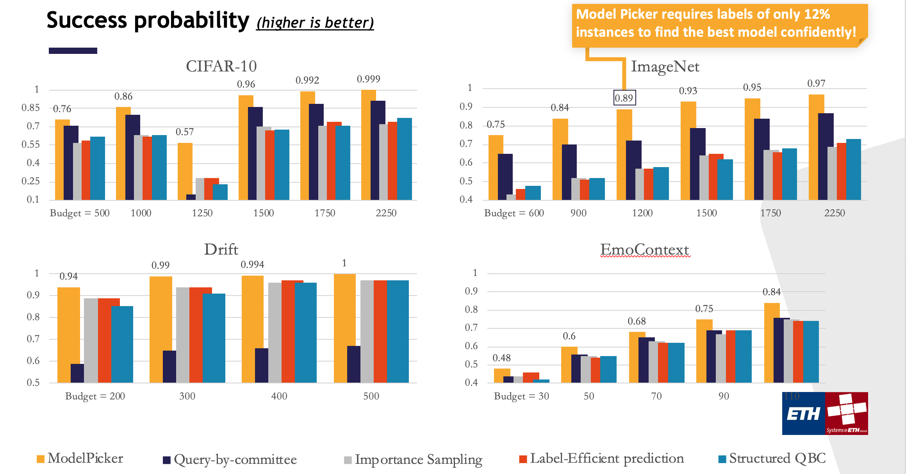

# Data Labeling for Testing and Model Selection
This repository aims to provide you the state-of-the-art algorithm that performs active data labeling for testing and model selection, the so-called ```modelpicker```. The ```modelpicker``` algorithm queries the labels of the most informative data instances such that the model with the highest test accuracy for your target prediction task in hand can be found with a minimal labeling cost. 

## Overview
Below we provide an overview of ```modelpicker```. For a quick start, please check [here](readme/##usage) or [our example notebook](https://github.com/easeml/modelpicker/blob/main/example.ipynb).


### Use cases
There are several scenarios where you can employ ```modelpicker```. The leading use cases are as follows:
- Imagine you have many pretrained models that are trained on different data slices. For a freshly collected new dataset, you do not want to train a model but rather select the one with maximum generalization accuracy on this fresh data. The ```modelpicker``` can achieve this with a minimal labeling cost. This has crucial importance in cases where there is a significant data drift compared to the training distribution in which your most recent model is trained on, however you do not want to retrain your model as there has been several times in which you train a model on a similar distribution to that of your target task.
- The ```modelpicker``` immediately applies to all scenarios in which you would like to select the best model for your tarrget task. The term "model" here refer to any distinction between two ML classifiers ranging from their training/validation sets to architectures or entirely different ML models.

### Principle

<p align="center">
  
</p>


### Why modelpicker?
```modelpicker``` is a strategy that speciliazes on selecting most informative instances with a mere aim to find the best pretrained model. Yet there are several strategies to select the most informative instances although they have different objectives than that of modelpicker. Despite that, these active and/or online learning strategies are in general very competitive baselines to measure/sort the uncertainty of data instances. We adapted those strategies for model selection and performed exhaustive comparisons to modelpicker, in which we observed a significant benefit in using modelpicker. Below results illustrate a summary of the comparison. We refer to here and here for a detailed look at the comparisons.

<p align="center">
  
</p>


## Usage
To run experiment on a set of collected pre-trained models, run this command:

```buildoutcfg
python3 modelpicker.py [--predictions] [--labelset] [--budget]
```

```buildoutcfg
arguments:
--predictions PREDICTIONS 
                          A csv file consisting of model predictions. This is a 2D array of model predictions on your freshly collected data with size 𝑁×𝑘 where 𝑁                           is the amount of unlabeled instances available at time 𝑡, and 𝑘 is the number of models. Each 
                          prediction is mapped to an integer.
--labelspace LABELS
                          A numpy array consisting of label set elements. For instance, for a dataset consisting of 4 
                          classes, a possible label set can be {0,1,2,3}. These labels should be consistent with the 
                          mapping used for prediction matrix as well.
--budget BUDGET 
                          An integer that indicates the labeling budget

outputs:
--bestmodel  
                          The best model based on the queried labels 
--beliefs 
                          The posterior belief on the models being best.
```
## Example
A jupyter notebook `example.ipynb` is available in the main repository to illustrate how to use the code with the arguments. 

## Citations

```bibtex
% Algorithm and Theory 
@article{karimigurel2021mp,
  title={Online Active Model Selection for Pretrained Classifiers},
  author={Karimi, Mohammad Reza and Gurel, Nezihe Merve and Karlas, Bojan and Rausch, Johannes and Zhang, Ce and Krause, Andreas},
  journal={International Conference on Artificial Intelligence and Statistics},
  volume={130},
  year={2021}
}
